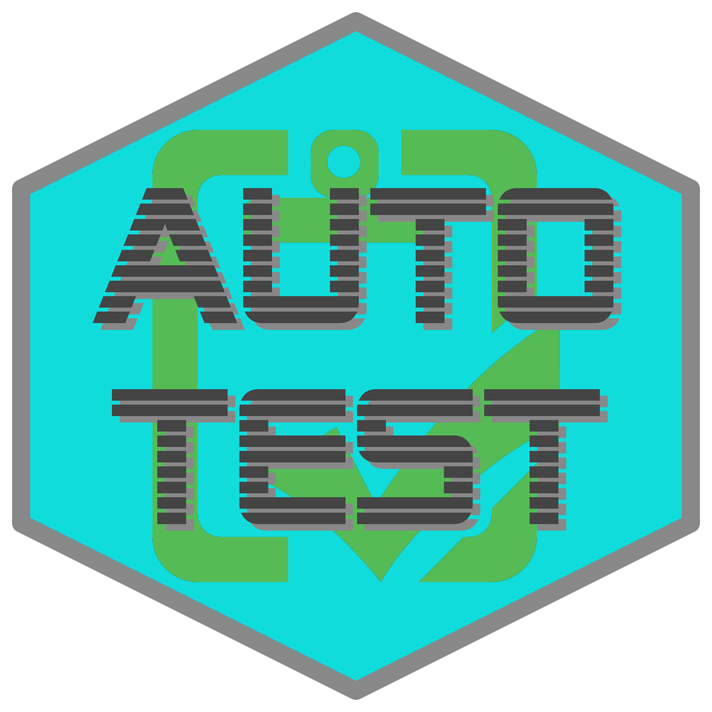

# autotest <a href='https://docs.ropensci.org/autotest/'></a>

<!-- README.md is generated from README.Rmd. Please edit that file -->

<!-- badges: start -->

[](https://github.com/ropensci-review-tools/autotest/actions/workflows/R-CMD-check.yaml)
[](https://app.codecov.io/gh/ropensci-review-tools/autotest)
[](https://www.repostatus.org/#active)
<!-- badges: end -->

Automatic mutation testing of R packages. Mutation in the sense of
mutating inputs (parameters) to function calls. `autotest` primarily
works by scraping documented examples for all functions, and mutating
the parameters input to those functions.

## Installation

The easiest way to install this package is via the associated
[`r-universe`](https://ropensci-review-tools.r-universe.dev/).
As shown there, simply enable the universe with

``` r
options (repos = c (
    ropenscireviewtools = "https://ropensci-review-tools.r-universe.dev",
    CRAN = "https://cloud.r-project.org"
))
```

And then install the usual way with,

``` r
install.packages ("autotest")
```

Alternatively, the package can be installed by running one of the
following lines:

``` r
# install.packages("remotes")
remotes::install_git ("https://codeberg.org/ropensci-review-tools/autotest")
remotes::install_git ("https://codefloe.com/ropensci-review-tools/autotest")
remotes::install_gitlab ("ropensci-review-tools/autotest")
remotes::install_github ("ropensci-review-tools/autotest")
remotes::install_git ("https://git.sr.ht/~mpadge/autotest")
remotes::install_bitbucket ("mpadge/autotest")
```

The package can then be loaded the usual way:

``` r
library (autotest)
```

## Usage

The simply way to use the package is

``` r
x <- autotest_package ("<package>")
```

The main argument to the [`autotest_package()`
function](https://docs.ropensci.org/autotest/reference/autotest_package.html)
can either be the name of an installed package, or a path to a local
directory containing the source for a package. The result is a
`data.frame` of errors, warnings, and other diagnostic messages issued
during package `autotest`-ing. The function has an additional parameter,
`functions`, to restrict tests to specified functions only.

By default,
[`autotest_package()`](https://docs.ropensci.org/autotest/reference/autotest_package.html)
returns a list of all tests applied to a package without actually
running them. To implement those tests, set the parameter `test` to
`TRUE`. Results are only returned for tests in which functions do not
behave as expected, whether through triggering errors, warnings, or
other behaviour as described below. The ideal behaviour of
`autotest_package()` is to return nothing (or strictly, `NULL`),
indicating that all tests passed successfully. See the [main package
vignette](https://docs.ropensci.org/autotest/articles/autotest.html) for
an introductory tour of the package.

## What is tested?

The package includes a function which lists all tests currently
implemented.

``` r
autotest_types ()
#> # A tibble: 27 × 8
#>    type  test_name      fn_name parameter parameter_type operation content test 
#>    <chr> <chr>          <chr>   <chr>     <chr>          <chr>     <chr>   <lgl>
#>  1 dummy rect_as_other  <NA>    <NA>      rectangular    Convert … "check… TRUE 
#>  2 dummy rect_compare_… <NA>    <NA>      rectangular    Convert … "expec… TRUE 
#>  3 dummy rect_compare_… <NA>    <NA>      rectangular    Convert … "expec… TRUE 
#>  4 dummy rect_compare_… <NA>    <NA>      rectangular    Convert … "expec… TRUE 
#>  5 dummy extend_rect_c… <NA>    <NA>      rectangular    Extend e… "(Shou… TRUE 
#>  6 dummy replace_rect_… <NA>    <NA>      rectangular    Replace … "(Shou… TRUE 
#>  7 dummy vector_to_lis… <NA>    <NA>      vector         Convert … "(Shou… TRUE 
#>  8 dummy vector_custom… <NA>    <NA>      vector         Custom c… "(Shou… TRUE 
#>  9 dummy double_is_int  <NA>    <NA>      numeric        Check wh… "int p… TRUE 
#> 10 dummy trivial_noise  <NA>    <NA>      numeric        Add triv… "(Shou… TRUE 
#> # ℹ 17 more rows
```

That functions returns a [`tibble`](https://tibble.tidyverse.org)
describing 27 unique tests. The default behaviour of
[`autotest_package()`](https://docs.ropensci.org/autotest/reference/autotest_package.html)
with `test = FALSE` uses these test types to identify which tests will
be applied to each parameter and function. The table returned from
[`autotest_types()`](https://docs.ropensci.org/autotest/reference/autotest_types.html)
can be used to selectively switch tests off by setting values in the
`test` column to `FALSE`, as demonstrated below.

## How Does It Work?

The package works by scraping documented examples from all `.Rd` help
files, and using those to identify the types of all parameters to all
functions. Usage therefore first requires that the usage of all
parameters be demonstrated in example code.

As described above, tests can also be selectively applied to particular
functions through the parameters `functions`, used to nominate functions
to include in tests, or `exclude`, used to nominate functions to exclude
from tests. The following code illustrates.

``` r
x <- autotest_package (package = "stats", functions = "var", test = FALSE)
#> namespace 'stats' is already loaded so argument 'keep.source' will be ignored.
#> Error in cov(swM, use = "all") : missing observations in cov/cor
#> R^2 = 0.21
print (x)
#> # A tibble: 21 × 8
#>    type    test_name    fn_name parameter parameter_type operation content test 
#>    <chr>   <chr>        <chr>   <chr>     <chr>          <chr>     <chr>   <lgl>
#>  1 warning par_is_demo… var     na.rm     <NA>           Check th… Exampl… TRUE 
#>  2 warning par_is_demo… var     use       <NA>           Check th… Exampl… TRUE 
#>  3 dummy   int_as_nume… var     x         integer vector Integer … (Shoul… TRUE 
#>  4 dummy   vector_to_l… var     x         vector         Convert … (Shoul… TRUE 
#>  5 dummy   negate_logi… var     na.rm     single logical Negate d… (Funct… TRUE 
#>  6 dummy   subst_int_f… var     na.rm     single logical Substitu… (Funct… TRUE 
#>  7 dummy   subst_char_… var     na.rm     single logical Substitu… should… TRUE 
#>  8 dummy   single_par_… var     na.rm     single logical Length 2… Should… TRUE 
#>  9 dummy   return_succ… var     (return … (return objec… Check th… <NA>    TRUE 
#> 10 dummy   return_val_… var     (return … (return objec… Check th… <NA>    TRUE 
#> # ℹ 11 more rows
```

Testing the `var` function also tests `cor` and `cov`, because these are
all documented within a single `.Rd` help file. Typing `?var` shows that
the help topic is `cor`, and that the examples include the three
functions, `var`, `cor`, and `cov`. That result details the 21 tests
which would be applied to the `var` function from the `stats` package.
These 21 tests yield the following results when actually applied:

``` r
y <- autotest_package (package = "stats", functions = "var", test = TRUE)
#> Error in cov(swM, use = "all") : missing observations in cov/cor
#> R^2 = 0.21
print (y)
#> # A tibble: 11 × 8
#>    type       test_name fn_name parameter parameter_type operation content test 
#>    <chr>      <chr>     <chr>   <chr>     <chr>          <chr>     <chr>   <lgl>
#>  1 warning    par_is_d… var     na.rm     <NA>           Check th… "Examp… TRUE 
#>  2 warning    par_is_d… var     use       <NA>           Check th… "Examp… TRUE 
#>  3 diagnostic vector_t… var     x         vector         Convert … "Funct… TRUE 
#>  4 diagnostic vector_t… var     y         vector         Convert … "Funct… TRUE 
#>  5 diagnostic subst_in… var     na.rm     single logical Substitu… "(Func… TRUE 
#>  6 diagnostic vector_t… var     x         vector         Convert … "Funct… TRUE 
#>  7 diagnostic vector_t… var     x         vector         Convert … "Funct… TRUE 
#>  8 diagnostic vector_t… var     x         vector         Convert … "Funct… TRUE 
#>  9 diagnostic vector_t… var     x         vector         Convert … "Funct… TRUE 
#> 10 diagnostic vector_t… var     x         vector         Convert … "Funct… TRUE 
#> 11 diagnostic vector_t… var     x         vector         Convert … "Funct… TRUE
```

And only 11 of the original 21 tests produced unexpected behaviour.
There were in fact only 3 kinds of tests which produced these 11
results:

``` r
unique (y$operation)
#> [1] "Check that parameter usage is demonstrated"     
#> [2] "Convert vector input to list-columns"           
#> [3] "Substitute integer values for logical parameter"
```

One of these involves conversion of a vector to a list-column
representation (via `I(as.list(<vec>))`). Relatively few packages accept
this kind of input, even though doing so is relatively straightforward.
The following lines demonstrate how these tests can be switched off when
`autotest`-ing a package. The `autotest_types()` function, used above to
extract information on all types of tests, also accepts a single
argument listing the `test_name` entries of any tests which are to be
switched off.

``` r
types <- autotest_types (notest = "vector_to_list_col")
y <- autotest_package (
    package = "stats", functions = "var",
    test = TRUE, test_data = types
)
#> Error in cov(swM, use = "all") : missing observations in cov/cor
#> R^2 = 0.21
print (y)
#> # A tibble: 3 × 8
#>   type       test_name  fn_name parameter parameter_type operation content test 
#>   <chr>      <chr>      <chr>   <chr>     <chr>          <chr>     <chr>   <lgl>
#> 1 warning    par_is_de… var     na.rm     <NA>           Check th… Exampl… TRUE 
#> 2 warning    par_is_de… var     use       <NA>           Check th… Exampl… TRUE 
#> 3 diagnostic subst_int… var     na.rm     single logical Substitu… (Funct… TRUE
```

Those tests are still returned from `autotest_package()`, but with
`test = FALSE` to indicate they were not run, and a `type` of “no_test”
rather than the previous “diagnostic”.

## Prior work

1.  The
    [`great-expectations`](https://github.com/fivetran/great_expectations)
    framework for python, described in [this medium
    article](https://medium.com/@expectgreatdata/down-with-pipeline-debt-introducing-great-expectations-862ddc46782a).
2.  [`QuickCheck`](https://hackage.haskell.org/package/QuickCheck) for
    Haskell
3.  [`mutate`](https://github.com/mbj/mutant) for ruby
4.  [`mutant`](https://github.com/sckott/mutant) for mutation of R
    code itself

## Code of Conduct

Please note that this package is released with a [Contributor Code of
Conduct](https://ropensci.org/code-of-conduct/). By contributing to this
project, you agree to abide by its terms.

## Contributors

<!-- ALL-CONTRIBUTORS-LIST:START - Do not remove or modify this section -->

<!-- prettier-ignore-start -->

<!-- markdownlint-disable -->

All contributions to this project are gratefully acknowledged using the [`allcontributors` package](https://github.com/ropensci/allcontributors) following the [allcontributors](https://allcontributors.org) specification. Contributions of any kind are welcome!

### Code

<table>

<tr>
<td align="center">
<a href="https://github.com/mpadge">

</a><br>
<a href="https://github.com/ropensci-review-tools/autotest/commits?author=mpadge">mpadge</a>
</td>
<td align="center">
<a href="https://github.com/helske">

</a><br>
<a href="https://github.com/ropensci-review-tools/autotest/commits?author=helske">helske</a>
</td>
<td align="center">
<a href="https://github.com/maelle">

</a><br>
<a href="https://github.com/ropensci-review-tools/autotest/commits?author=maelle">maelle</a>
</td>
<td align="center">
<a href="https://github.com/AntoineSoetewey">

</a><br>
<a href="https://github.com/ropensci-review-tools/autotest/commits?author=AntoineSoetewey">AntoineSoetewey</a>
</td>
<td align="center">
<a href="https://github.com/simpar1471">

</a><br>
<a href="https://github.com/ropensci-review-tools/autotest/commits?author=simpar1471">simpar1471</a>
</td>
<td align="center">
<a href="https://github.com/maurolepore">

</a><br>
<a href="https://github.com/ropensci-review-tools/autotest/commits?author=maurolepore">maurolepore</a>
</td>
</tr>

</table>


### Issue Authors

<table>

<tr>
<td align="center">
<a href="https://github.com/noamross">

</a><br>
<a href="https://github.com/ropensci-review-tools/autotest/issues?q=is%3Aissue+author%3Anoamross">noamross</a>
</td>
<td align="center">
<a href="https://github.com/njtierney">

</a><br>
<a href="https://github.com/ropensci-review-tools/autotest/issues?q=is%3Aissue+author%3Anjtierney">njtierney</a>
</td>
<td align="center">
<a href="https://github.com/JeffreyRStevens">

</a><br>
<a href="https://github.com/ropensci-review-tools/autotest/issues?q=is%3Aissue+author%3AJeffreyRStevens">JeffreyRStevens</a>
</td>
<td align="center">
<a href="https://github.com/bbolker">

</a><br>
<a href="https://github.com/ropensci-review-tools/autotest/issues?q=is%3Aissue+author%3Abbolker">bbolker</a>
</td>
<td align="center">
<a href="https://github.com/mattfidler">

</a><br>
<a href="https://github.com/ropensci-review-tools/autotest/issues?q=is%3Aissue+author%3Amattfidler">mattfidler</a>
</td>
<td align="center">
<a href="https://github.com/kieranjmartin">

</a><br>
<a href="https://github.com/ropensci-review-tools/autotest/issues?q=is%3Aissue+author%3Akieranjmartin">kieranjmartin</a>
</td>
<td align="center">
<a href="https://github.com/statnmap">

</a><br>
<a href="https://github.com/ropensci-review-tools/autotest/issues?q=is%3Aissue+author%3Astatnmap">statnmap</a>
</td>
</tr>


<tr>
<td align="center">
<a href="https://github.com/vgherard">

</a><br>
<a href="https://github.com/ropensci-review-tools/autotest/issues?q=is%3Aissue+author%3Avgherard">vgherard</a>
</td>
<td align="center">
<a href="https://github.com/christophsax">

</a><br>
<a href="https://github.com/ropensci-review-tools/autotest/issues?q=is%3Aissue+author%3Achristophsax">christophsax</a>
</td>
<td align="center">
<a href="https://github.com/joelnitta">

</a><br>
<a href="https://github.com/ropensci-review-tools/autotest/issues?q=is%3Aissue+author%3Ajoelnitta">joelnitta</a>
</td>
<td align="center">
<a href="https://github.com/santikka">

</a><br>
<a href="https://github.com/ropensci-review-tools/autotest/issues?q=is%3Aissue+author%3Asantikka">santikka</a>
</td>
<td align="center">
<a href="https://github.com/abigailkeller">

</a><br>
<a href="https://github.com/ropensci-review-tools/autotest/issues?q=is%3Aissue+author%3Aabigailkeller">abigailkeller</a>
</td>
<td align="center">
<a href="https://github.com/schneiderpy">

</a><br>
<a href="https://github.com/ropensci-review-tools/autotest/issues?q=is%3Aissue+author%3Aschneiderpy">schneiderpy</a>
</td>
<td align="center">
<a href="https://github.com/TanguyBarthelemy">

</a><br>
<a href="https://github.com/ropensci-review-tools/autotest/issues?q=is%3Aissue+author%3ATanguyBarthelemy">TanguyBarthelemy</a>
</td>
</tr>

</table>


### Issue Contributors

<table>

<tr>
<td align="center">
<a href="https://github.com/gilbertocamara">

</a><br>
<a href="https://github.com/ropensci-review-tools/autotest/issues?q=is%3Aissue+commenter%3Agilbertocamara">gilbertocamara</a>
</td>
</tr>

</table>

<!-- markdownlint-enable -->

<!-- prettier-ignore-end -->

<!-- ALL-CONTRIBUTORS-LIST:END -->
